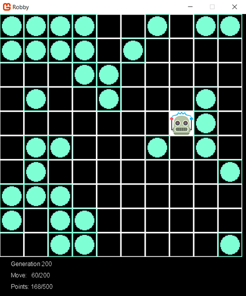

<<<<<<< HEAD
## Tasks that must be done

| Description |Priority | Status|Done by|
|--------|--------|--------|--------|
| IChromosome Implementation | High | Not Started | dsd |
| IChromosome Test Cases | Medium | Not Started | dsd |
| IGeneration Implementation | High | Not Started | dsd |
| IGeneration Test Cases | Medium | Not Started | dsd |
| IGeneticAlgorithm Implementation | High | Not Started | dsd |
| IGeneticAlgorithm Cases | Medium | Not Started | dsd |
|  | High | Not Started | dsd |

 Project Informations   

Background
Robby the Robot is described in Chapter 9 of Melanie Mitchell's book Complexity: A Guided Tour. Robby's task is to collect empty soda cans that lie scattered around his square grid world, by following instructions encoded in an array of 243 genome enumerations. 
 

# Genetic Algorithms
In a genetic algorithm (GA), the desired output is a solution to some problem….
The input to the GA has two parts: a population of candidate programs, and a fitness function that takes a candidate program and assigns to it a fitness value that measures how well that program works on the desired task.
Here is the recipe for the GA. 

Repeat the following steps for some number of generations: 
1. Generate an initial population of candidate solutions. The simplest way to create the initial population is just to generate a bunch of random programs (strings), called “individuals.” 
2. Calculate the fitness of each individual in the current population. 
3. Select some number of the individuals with highest fitness to be the parents of the next generation. 
4. Pair up the selected parents. Each pair produces offspring by recombining parts of the parents, with some chance of random mutations, and the offspring enter the new population. The selected parents continue creating offspring until the new population is full (i.e., has the same number of individuals as the initial population). The new population now becomes the current population. 
5. Go to step 2.

# Robby the Robot
I have a robot named “Robby” who lives in a (computer simulated, but messy) two-dimensional world that is strewn with empty soda cans. I am going to use a genetic algorithm to evolve a “brain” (that is, a control strategy) for Robby. 

Robby’s job is to clean up his world by collecting the empty soda cans. Robby’s world consists of 100 squares (sites) laid out in a 10 × 10 grid. Let’s imagine that there is a wall around the boundary of the entire grid. Various sites have been littered with soda cans (but with no more than one can per site). Robby isn’t very intelligent, he has no memory of his past moves, and his eyesight isn’t that great. From wherever he is, he can see the contents of one adjacent site in the north, south, east, and west directions, as well as the contents of the site he occupies. A site can be empty, contain a can, or be a wall. 
For each cleaning session, Robby can perform exactly 200 actions. Each action consists of one of the following seven choices: move to the north, move to the south, move to the east, move to the west, choose a random direction to move in, stay put, or bend down to pick up a can. Each action may generate a reward or a punishment. If Robby is in the same site as a can and picks it up, he gets a reward of ten points. However, if he bends down to pick up a can in a site where there is no can, he is fined one point. If he crashes into a wall, he is fined five points and bounces back into the current site.
Clearly, Robby’s reward is maximized when he picks up as many cans as possible, without crashing into any walls or bending down to pick up a can if no can is there.
****
The first step is to figure out exactly what we are evolving; that is, what exactly constitutes a strategy? In general, a strategy is a set of rules that gives, for any situation, the action you should take in that situation. For Robby, a “situation” is simply what he can see: the contents of his current site plus the contents of the north, south, east, and west sites. For the question “what to do in each situation,” Robby has seven possible things he can do: move north, south, east, or west; move in a random direction; stay put; or pick up a can.
Therefore, a strategy for Robby can be written simply as a list of all the possible situations he could encounter, and for each possible situation, which of the seven possible actions he should perform.
How many possible situations are there? Robby looks at five different sites (current, north, south, east, west), and each of those sites can be labeled as empty, contains can, or wall. This means that there are 243 different possible situations (see the notes for an explanation of how I calculated this). Actually, there aren’t really that many, since Robby will never face a situation in which his current site is a wall, or one in which north, south, east, and west are all walls. There are other “impossible” situations as well. Again, being lazy, we don’t want to figure out what all the impossible situations are, so we’ll just list all 243 situations, and know that some of them will never be encountered.
To decide what to do next, Robby simply looks up this situation in his strategy table, and finds that the corresponding action is MoveWest, for example. So he moves west.
___
## Instructions
### The project is split into 4 distinct parts:
1.	The genetic algorithm library the implements the algorithm itself
2.	The RobbyTheRobot library that implements the logic of Robby
3.	The console application that calls the library, generates the permutations, and saves the results to a series of text files
4.	The GUI visualization which reads the text files generated by the console app and shows Robby’s progress through the different generations
Setting up the Projects
The following projects will need to be created, see below for details on what they contain:
•	A console application called RobbyIterationGenerator
•	A class library called GeneticAlgortihm
•	A class library called RobbyTheRobot
•	A MonoGame project called RobbyVisualizer
Ensure you use the –framework argument when calling dotnet new and specify a netcoreapp3.1
Note, add appropriate unit tests and their associated projects when necessary. Ensure you follow the standard naming convention already established in class.
Genetic Algorithm Library
The genetic algorithm library is responsible for creating the different generations, handling the chromosomes, and evolving, mutating, and crossing the chromosomes. The class GeneticLib is provided to create the IGeneticAlgorithm. Note, all the implementations of the library should be internal to the DLL.
The following interfaces must be implemented, for details on each method see the documentation in the interface itself:
•	IChromosome
o	Represents a chromosome which contains an array of integers representing the genes
o	The concreate implementation requires two constructors:
	One that takes the number of genes, the length of a gene, and a potential seed
	Performs a deep copy of the Chromosome
o	Chromosomes should be compared based on their Fitness
o	The concreate implementation requires a Cross method that crosses two Chromosomes
	For more information see the class lecture
•	IGenerationDetails
o	Contains an array of Chromosome
o	The concrete implementation requires two constructors
	One that takes the IGeneticAlgorithm, FitnessEventHandler, and a potential seed
	Performs a deep copy the generation based on an array of IChromosomes
o	For other methods see the interface documentation
•	IGeneticAlgorithm
o	Contains a constructor that takes the population size, number of genes, length of genes, mutation rate, elite rate, number of trials, the fitness function, and a potential seed
o	Implements a private method call GenerateNextGeneration
	This method must create the next set of Chromosomes through reproduction
	The elite rate should be used to select only a subset of the best Chromosomes based on fitness
	A new Generation should be created based on the resulting child Chromosomes

### Robby The Robot Library
The Robby the Robot library is responsible for understanding Robby’s world and calling the Genetic Algorithm. It must implement the IRobbyTheRobot interface. The following classes must be implemented:

### RobbyTheRobot
-	Implements the IRobbyTheRobot
-	Is an internal class
-	Contains a constructor that takes the number of generations, population size, number of trials, and a potential seed
-	RobbyTheRobot uses the GeneticAlgorithm library to evolve.
-	The library requires a ComputeFitness function that is called to determine the score. Note, your ComputeFitness function is responsible for generating a random grid and running robby through the grid and scoring his moves. The RobbyHelper class will assist you in the scoring part.
-	Provides a custom delegate and event for notifying user when a file has been written
-	The event should provide meta data about the file.
-	Note, the event and delegate will need to be added to the interface.
•	Robby
  -	A public static class containing a public static method called CreateRobby, which returns an IRobbyTheRobot interface
The following items are provided to assist you in developing Robby:
 -	DirectionofGridContents
-	A struct containing the possible directions Robby can move in
 -	ContentsOfGrid
-	An enum indicating what is currently placed at each grid location
-	PossibleMoves
-	A list of possible moves Robby can make
-	RobbyHelper
-	A helper class with several useful methods

	Notice the ScoreForAllele method, which takes a test grid and a IChromosome to determine the fitness of Robby’s action

# Console Application
The console application will be responsible for creating the text files representing the different iterations of the GA by calling the GeneticAlgorithm library. It must provide a user interface that prompts the user where to save the text files and provides input parameters for the generation. The application should print out the progress of the solution generation using the appropriate event. Additionally, there should be a way to stop the progress of the generation from the UI.
Graphical Simulation
After generating the possible solutions using RobbyIterationGenerator, the MonoGame project will display Robby’s strategy for these generations so to visualize the improvement. MonoGame will take care of the game loop, updates, and drawing. 
Project setup
Ensure you rename your Game1.cs to RobbyVisualizerGame.cs
You will need a reference to your RobbyTheRobot project since you will use ScoreForAllele method and GenerateRandomTestGrid. 

# Logic
Within the game project, you will add a SimulationSprite class to represent the drawing on screen.
The MonoGame application must provide a way for users to select the folder containing the solutions to be run. The files should be loaded into the program and run. 
In each update (after a counter throttles), it will perform the required move, and update the score. Use the ScoreForAllele method to calculate the score on each Update. 
The Draw method draws the images and writes the fitness and moves. All pngs should be 32 x 32, and these dimensions can be used to calculate where to draw each png. For example, to draw a can at position [x,y], the Draw method will look something like:
spriteBatch.Draw(imageCan, new Rectangle(x * 32, y * 32, 32, 32), Color.White);
(nb: the last argument indicates the colour to tint. Color.White means no tinting). 

# Team Coding Standards and Practices
This project must be done in the teams assigned. As seen in previous semesters each individual person must have their own feature branches to which they will contribute:
•	Each person should freely make commits and pushes within their feature branch 
•	Whenever you wish to merge your code into Main, you will create a merge request
•	The merge request must be code reviewed. This means that someone other than the author should review the merge request and give constructive comments as to whether the request is good or not.
o	In addition to providing text comments, they should give either a “thumbs up” or a “thumbs down” (in GitLab) to indicate whether they approve of the merge or not
o	You should only give a thumbs up if the code is good to go (other than extremely minor changes, such as renaming a variable)
•	Once the merge request has received a thumbs up, the original author of the change should merge the code into the Main branch
o	Note that in the case that there are other changes made to the staging branch in the interim, they may need to make a new merge request. 

# Deliverable
Create a private Gitlab repo to track your code. Add your instructor as a maintainer to the repo (section 1 swetha411, section 2 ddubois1). When developing, ensure you use the feature branch model. Ensure that your initial commit in the repo is just the gitignore so that the Submission branch can be created successfully.
The deliverable will consist of a Merge Request (Pull request) from your main branch to a branch called Submission. Note, in this case you are merging from main into the Submission branch you have created. There must be no commits on the Submission branch, and the change list should show all the code you have modified in main. Submit the URL for the Merge Request to Moodle.
Additionally, groups will perform a demo of their project during lab time, where they will be asked to demonstrate certain functionality and explain aspects of their code design.
Proper code standards should be followed when developing the solution. However, students have the freedom to design graphics and alter the presentation of the GUI as they see fit, provided it meets the basic requirements of the assignment.
Resources
•	2D MonoGame graphics http://rbwhitaker.wikidot.com/monogame-2d-tutorials
•	Testing internal assemblies
Internal classes can be tested provided you indicate to the assembly that the test project is allowed to see it. Modify the .csproj of the assembly with the internal classes to be tested with the following snippet. Note, parameter 1 contains the name of the test assembly that should be able to see the classes:
<ItemGroup>
  <AssemblyAttribute Include="System.Runtime.CompilerServices.InternalsVisibleTo">
    <_Parameter1>$(MSBuildProjectName)Tests</_Parameter1>
  </AssemblyAttribute>
</ItemGroup>
=======
## Tasks that must be done

| Description |Priority | Status|Done by|
|--------|--------|--------|--------|
| IChromosome Implementation | High | Not Started | Cuneyt |
| IChromosome Test Cases | Medium | Not Started | name |
| IGeneration Implementation | High | Not Started | Cuneyt |
| IGeneration Test Cases | Medium | Not Started | name |
| IGeneticAlgorithm Implementation | High | Not Started | Cuneyt |
| IGeneticAlgorithm Cases | Medium | Not Started | name |
|  | Not stated | Not Started | name |

 Project Informations   

Background
Robby the Robot is described in Chapter 9 of Melanie Mitchell's book Complexity: A Guided Tour. Robby's task is to collect empty soda cans that lie scattered around his square grid world, by following instructions encoded in an array of 243 genome enumerations. 
 

# Genetic Algorithms
In a genetic algorithm (GA), the desired output is a solution to some problem….
The input to the GA has two parts: a population of candidate programs, and a fitness function that takes a candidate program and assigns to it a fitness value that measures how well that program works on the desired task.
Here is the recipe for the GA. 

Repeat the following steps for some number of generations: 
1. Generate an initial population of candidate solutions. The simplest way to create the initial population is just to generate a bunch of random programs (strings), called “individuals.” 
2. Calculate the fitness of each individual in the current population. 
3. Select some number of the individuals with highest fitness to be the parents of the next generation. 
4. Pair up the selected parents. Each pair produces offspring by recombining parts of the parents, with some chance of random mutations, and the offspring enter the new population. The selected parents continue creating offspring until the new population is full (i.e., has the same number of individuals as the initial population). The new population now becomes the current population. 
5. Go to step 2.

# Robby the Robot
I have a robot named “Robby” who lives in a (computer simulated, but messy) two-dimensional world that is strewn with empty soda cans. I am going to use a genetic algorithm to evolve a “brain” (that is, a control strategy) for Robby. 

Robby’s job is to clean up his world by collecting the empty soda cans. Robby’s world consists of 100 squares (sites) laid out in a 10 × 10 grid. Let’s imagine that there is a wall around the boundary of the entire grid. Various sites have been littered with soda cans (but with no more than one can per site). Robby isn’t very intelligent, he has no memory of his past moves, and his eyesight isn’t that great. From wherever he is, he can see the contents of one adjacent site in the north, south, east, and west directions, as well as the contents of the site he occupies. A site can be empty, contain a can, or be a wall. 
For each cleaning session, Robby can perform exactly 200 actions. Each action consists of one of the following seven choices: move to the north, move to the south, move to the east, move to the west, choose a random direction to move in, stay put, or bend down to pick up a can. Each action may generate a reward or a punishment. If Robby is in the same site as a can and picks it up, he gets a reward of ten points. However, if he bends down to pick up a can in a site where there is no can, he is fined one point. If he crashes into a wall, he is fined five points and bounces back into the current site.
Clearly, Robby’s reward is maximized when he picks up as many cans as possible, without crashing into any walls or bending down to pick up a can if no can is there.
****
The first step is to figure out exactly what we are evolving; that is, what exactly constitutes a strategy? In general, a strategy is a set of rules that gives, for any situation, the action you should take in that situation. For Robby, a “situation” is simply what he can see: the contents of his current site plus the contents of the north, south, east, and west sites. For the question “what to do in each situation,” Robby has seven possible things he can do: move north, south, east, or west; move in a random direction; stay put; or pick up a can.
Therefore, a strategy for Robby can be written simply as a list of all the possible situations he could encounter, and for each possible situation, which of the seven possible actions he should perform.
How many possible situations are there? Robby looks at five different sites (current, north, south, east, west), and each of those sites can be labeled as empty, contains can, or wall. This means that there are 243 different possible situations (see the notes for an explanation of how I calculated this). Actually, there aren’t really that many, since Robby will never face a situation in which his current site is a wall, or one in which north, south, east, and west are all walls. There are other “impossible” situations as well. Again, being lazy, we don’t want to figure out what all the impossible situations are, so we’ll just list all 243 situations, and know that some of them will never be encountered.
To decide what to do next, Robby simply looks up this situation in his strategy table, and finds that the corresponding action is MoveWest, for example. So he moves west.
___
## Instructions
### The project is split into 4 distinct parts:
1.	The genetic algorithm library the implements the algorithm itself
2.	The RobbyTheRobot library that implements the logic of Robby
3.	The console application that calls the library, generates the permutations, and saves the results to a series of text files
4.	The GUI visualization which reads the text files generated by the console app and shows Robby’s progress through the different generations
Setting up the Projects
The following projects will need to be created, see below for details on what they contain:
•	A console application called RobbyIterationGenerator
•	A class library called GeneticAlgortihm
•	A class library called RobbyTheRobot
•	A MonoGame project called RobbyVisualizer
Ensure you use the –framework argument when calling dotnet new and specify a netcoreapp3.1
Note, add appropriate unit tests and their associated projects when necessary. Ensure you follow the standard naming convention already established in class.
Genetic Algorithm Library
The genetic algorithm library is responsible for creating the different generations, handling the chromosomes, and evolving, mutating, and crossing the chromosomes. The class GeneticLib is provided to create the IGeneticAlgorithm. Note, all the implementations of the library should be internal to the DLL.
The following interfaces must be implemented, for details on each method see the documentation in the interface itself:
•	IChromosome
o	Represents a chromosome which contains an array of integers representing the genes
o	The concreate implementation requires two constructors:
	One that takes the number of genes, the length of a gene, and a potential seed
	Performs a deep copy of the Chromosome
o	Chromosomes should be compared based on their Fitness
o	The concreate implementation requires a Cross method that crosses two Chromosomes
	For more information see the class lecture
•	IGenerationDetails
o	Contains an array of Chromosome
o	The concrete implementation requires two constructors
	One that takes the IGeneticAlgorithm, FitnessEventHandler, and a potential seed
	Performs a deep copy the generation based on an array of IChromosomes
o	For other methods see the interface documentation
•	IGeneticAlgorithm
o	Contains a constructor that takes the population size, number of genes, length of genes, mutation rate, elite rate, number of trials, the fitness function, and a potential seed
o	Implements a private method call GenerateNextGeneration
	This method must create the next set of Chromosomes through reproduction
	The elite rate should be used to select only a subset of the best Chromosomes based on fitness
	A new Generation should be created based on the resulting child Chromosomes

### Robby The Robot Library
The Robby the Robot library is responsible for understanding Robby’s world and calling the Genetic Algorithm. It must implement the IRobbyTheRobot interface. The following classes must be implemented:

### RobbyTheRobot
-	Implements the IRobbyTheRobot
-	Is an internal class
-	Contains a constructor that takes the number of generations, population size, number of trials, and a potential seed
-	RobbyTheRobot uses the GeneticAlgorithm library to evolve.
-	The library requires a ComputeFitness function that is called to determine the score. Note, your ComputeFitness function is responsible for generating a random grid and running robby through the grid and scoring his moves. The RobbyHelper class will assist you in the scoring part.
-	Provides a custom delegate and event for notifying user when a file has been written
-	The event should provide meta data about the file.
-	Note, the event and delegate will need to be added to the interface.
•	Robby
  -	A public static class containing a public static method called CreateRobby, which returns an IRobbyTheRobot interface
The following items are provided to assist you in developing Robby:
 -	DirectionofGridContents
-	A struct containing the possible directions Robby can move in
 -	ContentsOfGrid
-	An enum indicating what is currently placed at each grid location
-	PossibleMoves
-	A list of possible moves Robby can make
-	RobbyHelper
-	A helper class with several useful methods

	Notice the ScoreForAllele method, which takes a test grid and a IChromosome to determine the fitness of Robby’s action

# Console Application
The console application will be responsible for creating the text files representing the different iterations of the GA by calling the GeneticAlgorithm library. It must provide a user interface that prompts the user where to save the text files and provides input parameters for the generation. The application should print out the progress of the solution generation using the appropriate event. Additionally, there should be a way to stop the progress of the generation from the UI.
Graphical Simulation
After generating the possible solutions using RobbyIterationGenerator, the MonoGame project will display Robby’s strategy for these generations so to visualize the improvement. MonoGame will take care of the game loop, updates, and drawing. 
Project setup
Ensure you rename your Game1.cs to RobbyVisualizerGame.cs
You will need a reference to your RobbyTheRobot project since you will use ScoreForAllele method and GenerateRandomTestGrid. 

# Logic
Within the game project, you will add a SimulationSprite class to represent the drawing on screen.
The MonoGame application must provide a way for users to select the folder containing the solutions to be run. The files should be loaded into the program and run. 
In each update (after a counter throttles), it will perform the required move, and update the score. Use the ScoreForAllele method to calculate the score on each Update. 
The Draw method draws the images and writes the fitness and moves. All pngs should be 32 x 32, and these dimensions can be used to calculate where to draw each png. For example, to draw a can at position [x,y], the Draw method will look something like:
spriteBatch.Draw(imageCan, new Rectangle(x * 32, y * 32, 32, 32), Color.White);
(nb: the last argument indicates the colour to tint. Color.White means no tinting). 

# Team Coding Standards and Practices
This project must be done in the teams assigned. As seen in previous semesters each individual person must have their own feature branches to which they will contribute:
•	Each person should freely make commits and pushes within their feature branch 
•	Whenever you wish to merge your code into Main, you will create a merge request
•	The merge request must be code reviewed. This means that someone other than the author should review the merge request and give constructive comments as to whether the request is good or not.
o	In addition to providing text comments, they should give either a “thumbs up” or a “thumbs down” (in GitLab) to indicate whether they approve of the merge or not
o	You should only give a thumbs up if the code is good to go (other than extremely minor changes, such as renaming a variable)
•	Once the merge request has received a thumbs up, the original author of the change should merge the code into the Main branch
o	Note that in the case that there are other changes made to the staging branch in the interim, they may need to make a new merge request. 

# Deliverable
Create a private Gitlab repo to track your code. Add your instructor as a maintainer to the repo (section 1 swetha411, section 2 ddubois1). When developing, ensure you use the feature branch model. Ensure that your initial commit in the repo is just the gitignore so that the Submission branch can be created successfully.
The deliverable will consist of a Merge Request (Pull request) from your main branch to a branch called Submission. Note, in this case you are merging from main into the Submission branch you have created. There must be no commits on the Submission branch, and the change list should show all the code you have modified in main. Submit the URL for the Merge Request to Moodle.
Additionally, groups will perform a demo of their project during lab time, where they will be asked to demonstrate certain functionality and explain aspects of their code design.
Proper code standards should be followed when developing the solution. However, students have the freedom to design graphics and alter the presentation of the GUI as they see fit, provided it meets the basic requirements of the assignment.
Resources
•	2D MonoGame graphics http://rbwhitaker.wikidot.com/monogame-2d-tutorials
•	Testing internal assemblies
Internal classes can be tested provided you indicate to the assembly that the test project is allowed to see it. Modify the .csproj of the assembly with the internal classes to be tested with the following snippet. Note, parameter 1 contains the name of the test assembly that should be able to see the classes:
<ItemGroup>
  <AssemblyAttribute Include="System.Runtime.CompilerServices.InternalsVisibleTo">
    <_Parameter1>$(MSBuildProjectName)Tests</_Parameter1>
  </AssemblyAttribute>
</ItemGroup>
>>>>>>> 2481884d76448227c2ed73d9c6ca751aec9215f4

